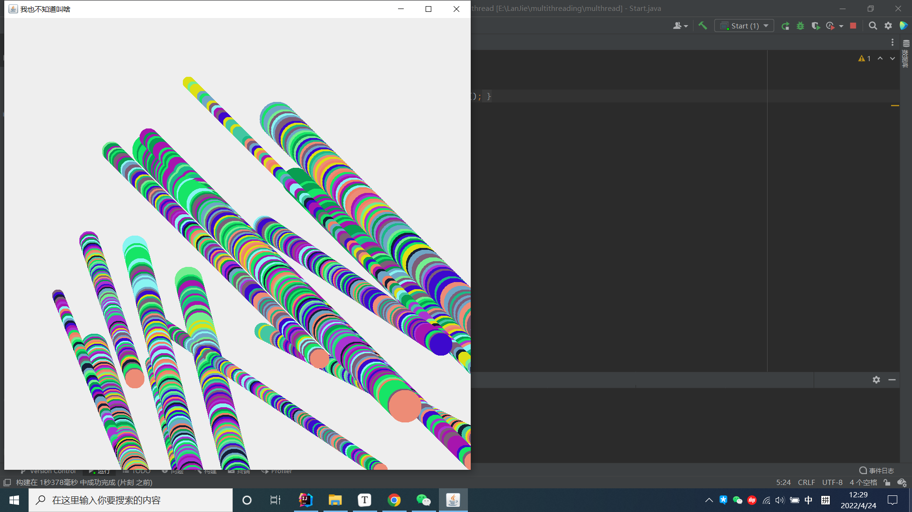

# 多线程实现移动的小球  v1.0
### 各个类的功能
- Ball：小球的基本参数，draw，move方法
- 监听器：监听鼠标按下的动作。new一个小球，new一个线程并启动。
- BallThread：每个线程是一个小球，一个线程既要move又要draw。

### 一些值得注意的问题

- 所有小球共用一个画笔，就会出现上面这种线程不安全问题。解决方法见**监听器**中的注释。
- 小球move和draw的衔接问题。见BallThread中的注释。